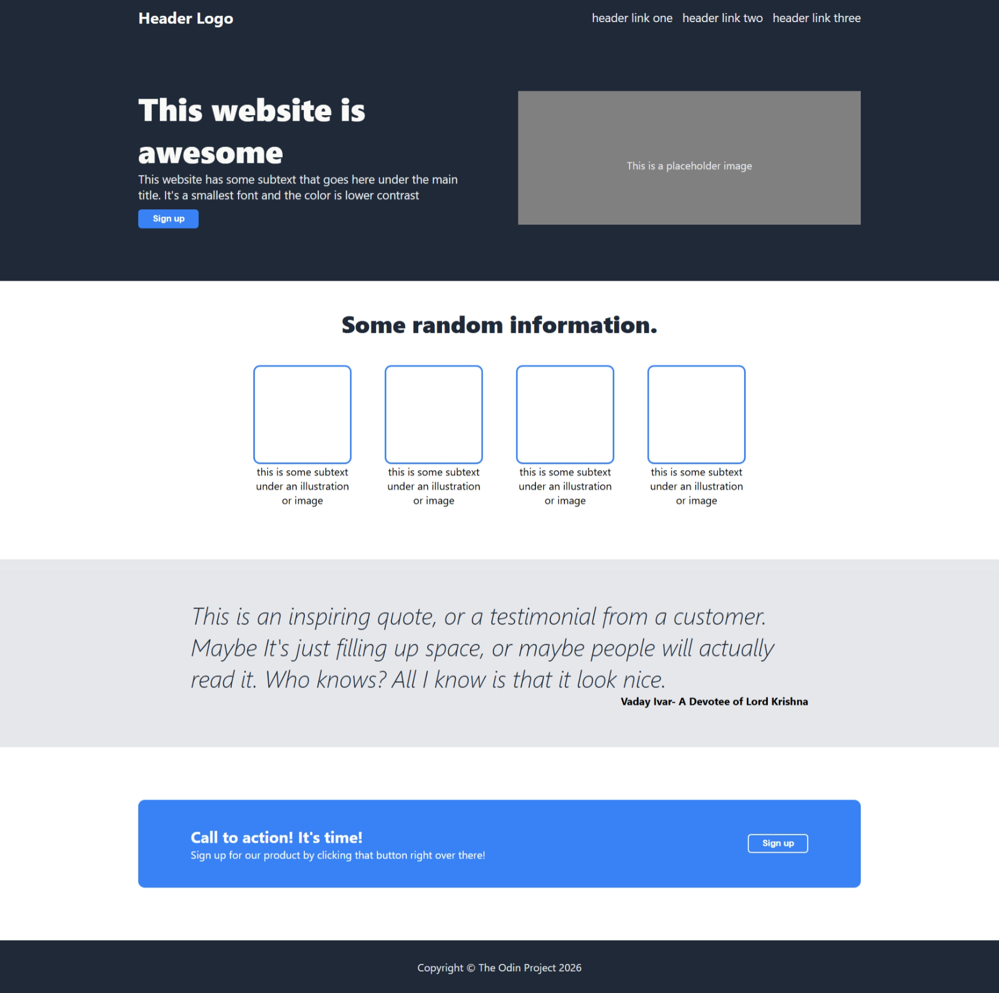

# Landing-Page

A responsive landing page built using HTML5 and CSS3 Flexbox, focused on layout alignment, spacing, and clean UI structure.

---

📖 Description

This project is a practice implementation of a modern landing page design. The goal was to replicate a given layout using Flexbox and improve understanding of real-world UI structuring.

The project emphasizes:

- Proper alignment of elements
- Clean and maintainable CSS structure

---

🚀 Features

- Flexbox-based design
- Clean and minimal UI
- Structured sections (header, hero, main, footer)
- Image and text alignment handling

---

🛠️ Tech Stack

- HTML5
- CSS3 (Flexbox)

---

📸 Preview

## 

🎯 What I Learned

- How "display: flex" controls layout
- Difference between "justify-content" and "align-items"
- Handling image sizing and overflow issues
- Using "gap" for consistent spacing
- Structuring a landing page layout from scratch

📂 Folder Structure

/project
├── index.html
├── style.css
└── images/

---

🔗 Live Demo

https://vadayivar.github.io/Landing-Page/

---

🙋‍♂️ Author

Ravi Yadav

---
